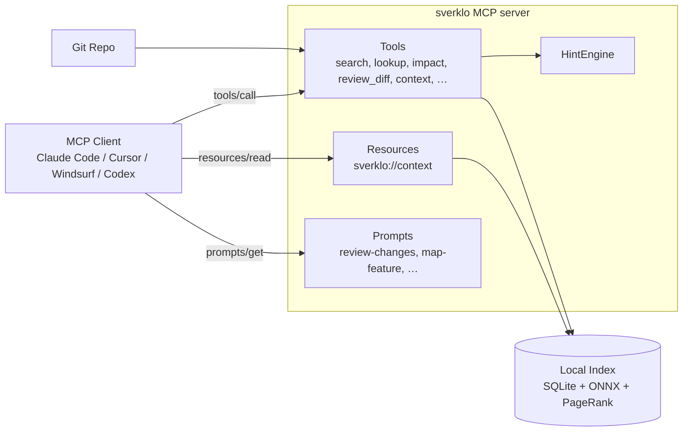
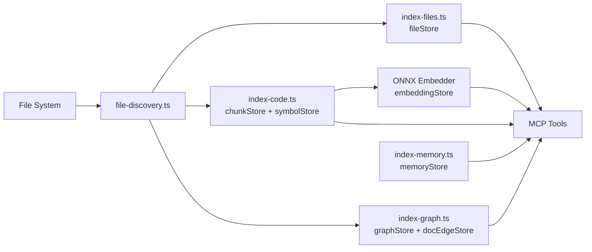
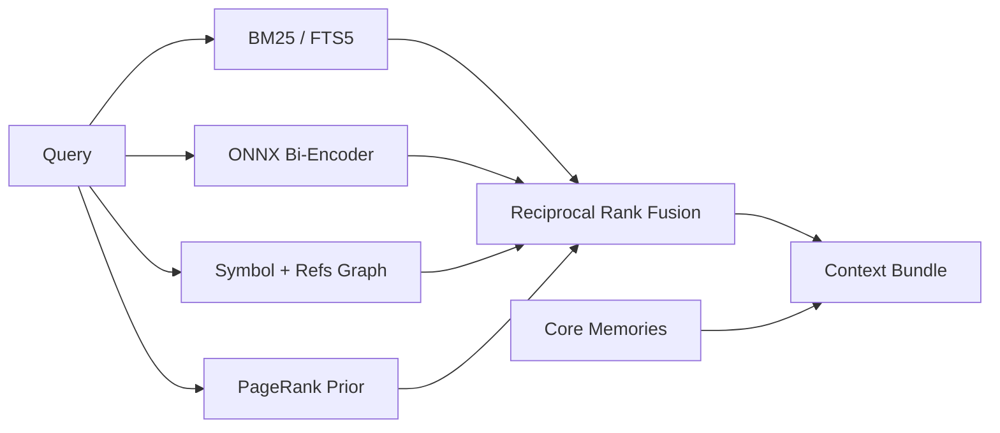
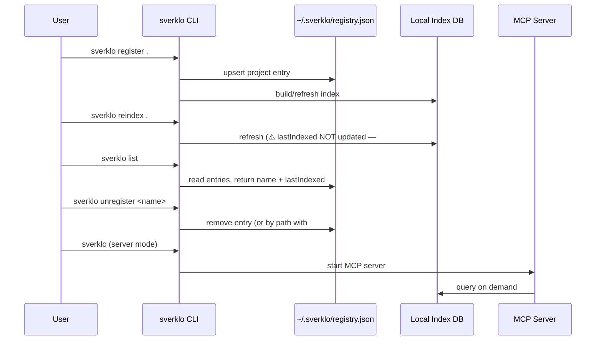

# Human Manual

## What This Pack Helps With

give AI coding hosts a local-first Sverklo memory workflow with workspace initialization, indexing checks, receipt verification, and safe recovery

## How To Use

1. Read `README.md`.
2. Load `AGENTS.md` or `CLAUDE.md`.
3. Run evals.
4. Use pitfall and risk files to recover from failure.

## What This Pack Does Not Do

- It does not replace upstream docs.
- It does not prove production readiness.
- It does not claim official endorsement.

## Doramagic Source Extract

# https://github.com/sverklo/sverklo Project Manual

Generated at: 2026-06-04 18:01:47 UTC

## Table of Contents

- [System Overview & MCP Integration](#page-overview)
- [Indexer, Parsers & Language Coverage](#page-indexer)
- [Storage, Bi-Temporal Memory & Hybrid Search](#page-storage-search)
- [CLI Workflows, Registry & Operations](#page-cli-ops)

## System Overview & MCP Integration

### Related Pages

Related topics: [CLI Workflows, Registry & Operations](#page-cli-ops), [Storage, Bi-Temporal Memory & Hybrid Search](#page-storage-search)

Related Source Files

The following source files were used to generate this page:

- [package.json](https://github.com/sverklo/sverklo/blob/main/package.json)
- [src/server/mcp-server.ts](https://github.com/sverklo/sverklo/blob/main/src/server/mcp-server.ts)
- [src/server/tool-overrides.ts](https://github.com/sverklo/sverklo/blob/main/src/server/tool-overrides.ts)
- [src/server/prompts.ts](https://github.com/sverklo/sverklo/blob/main/src/server/prompts.ts)
- [src/server/tools/context.ts](https://github.com/sverklo/sverklo/blob/main/src/server/tools/context.ts)
- [src/server/hints.ts](https://github.com/sverklo/sverklo/blob/main/src/server/hints.ts)
- [src/server/tools/review-format.ts](https://github.com/sverklo/sverklo/blob/main/src/server/tools/review-format.ts)
- [src/server/tools/diff-search.ts](https://github.com/sverklo/sverklo/blob/main/src/server/tools/diff-search.ts)
- [action/README.md](https://github.com/sverklo/sverklo/blob/main/action/README.md)
- [agents/sverklo-explore.md](https://github.com/sverklo/sverklo/blob/main/agents/sverklo-explore.md)

# System Overview & MCP Integration

## 1. Purpose & Scope

Sverklo is a **local-first MCP (Model Context Protocol) server** that gives coding agents persistent repo memory. The package description in [package.json](https://github.com/sverklo/sverklo/blob/main/package.json) frames it as: "Repo memory for coding agents. Local-first MCP for Claude Code, Cursor, Windsurf, and Codex CLI: symbol graph, blast radius, diff-aware review, and git-pinned decisions. MIT; no API keys or code upload."

The server's stated role to clients appears in its `instructions` field: "Sverklo: code intelligence for this repo. Use it for exploratory search, refactor blast-radius, dependency graphs, diff-aware review, and persistent memory across sessions. Prefer Grep/Read for exact-string lookups and single-file edits." (see [src/server/mcp-server.ts](https://github.com/sverklo/sverklo/blob/main/src/server/mcp-server.ts)).

At runtime, sverklo combines multiple retrieval signals — BM25 keyword search, ONNX bi-encoder embeddings, and a PageRank-weighted symbol graph — fused via reciprocal rank fusion. Issue [#29](https://github.com/sverklo/sverklo/issues/29) tracks the community's interest in evaluating ColBERT/PLAID-style multi-vector rerankers on top of this stack. The server runs on Node.js ≥ 24 (see `engines` in [package.json](https://github.com/sverklo/sverklo/blob/main/package.json)) and is published as a single binary named `sverklo`.

## 2. MCP Server Architecture

Sverklo implements two MCP entry points from [src/server/mcp-server.ts](https://github.com/sverklo/sverklo/blob/main/src/server/mcp-server.ts): a single-repo server bound to one index, and a **global multi-repo server** (`startGlobalMcpServer`) backed by an `IndexerPool` and a `HintEngine`. The global server's instructions read: "Sverklo (global mode): code intelligence serving multiple repos. Use the `list_repos` tool to see available repositories, then pass the repo name to any tool. If only one repo is registered, the repo parameter is optional."

The server registers three MCP capability surfaces:

| Surface | Purpose | Source |
|---|---|---|
| **Tools** | Search, lookup, impact, diff review, context, audit, etc. (gated by presets) | [src/server/mcp-server.ts](https://github.com/sverklo/sverklo/blob/main/src/server/mcp-server.ts), [src/server/tool-overrides.ts](https://github.com/sverklo/sverklo/blob/main/src/server/tool-overrides.ts) |
| **Resources** | `sverklo://context` auto-injected at session start, returning core memories and a project overview | [src/server/mcp-server.ts](https://github.com/sverklo/sverklo/blob/main/src/server/mcp-server.ts) |
| **Prompts** | Workflow templates (`sverklo/review-changes`, `sverklo/map-feature`, …) shown in IDE pickers | [src/server/prompts.ts](https://github.com/sverklo/sverklo/blob/main/src/server/prompts.ts) |

The MCP server name is declared in [package.json](https://github.com/sverklo/sverklo/blob/main/package.json) as `mcpName: "io.github.sverklo/sverklo"`. **Community note:** issue [#71](https://github.com/sverklo/sverklo/issues/71) reports that all sverklo tools are already internally prefixed `sverklo_*` (e.g., `sverklo_impact`), and when the server is registered in a client under the key `"sverklo"`, hosts that auto-prefix produce the doubled name `sverklo_sverklo_impact`. Tool naming is therefore a load-bearing concern for any MCP client integration.

## 3. Tool Surface & Presets

Rather than exposing one flat list, sverklo ships **role-scoped tool presets** defined in [src/server/tool-overrides.ts](https://github.com/sverklo/sverklo/blob/main/src/server/tool-overrides.ts): `core`, `nav`, `lean`, `research`, and `review`. The `research` preset is documented as "For agents doing open-ended code research / onboarding. Skips memory, diff/review, audit — keeps the multi-signal investigation surface plus ctx-handle ops for iterative refinement." The `review` preset front-loads diff tools for PR/MR workflows: `review_diff`, `diff_search`, `test_map`, `impact`, `refs`, plus verification helpers.

Several flagship tools warrant attention:

- **`context`** — the umbrella bundler in [src/server/tools/context.ts](https://github.com/sverklo/sverklo/blob/main/src/server/tools/context.ts). Its description states: "Use this as the FIRST call when you start working on a new task and want to orient quickly. PASS `budget` for a PageRank-pruned repo map fit to a token budget — the ideal way to give an agent a complete mental model of an unfamiliar codebase in one call."
- **`review_diff`** + **structured PR review payload** — [src/server/tools/review-format.ts](https://github.com/sverklo/sverklo/blob/main/src/server/tools/review-format.ts) emits both a markdown sticky comment and a JSON body suitable for `pulls.createReview`, with `path` / `line` / `severity` inline comments anchored to heuristic findings.
- **`diff_search`** — [src/server/tools/diff-search.ts](https://github.com/sverklo/sverklo/blob/main/src/server/tools/diff-search.ts) restricts a search to a git ref range and can fan out N hops to include callers of changed files.
- **Critique/verify** — [src/server/tools/critique.ts](https://github.com/sverklo/sverklo/blob/main/src/server/tools/critique.ts) cross-checks cited evidence, flags stale and moved files, and surfaces hubs that the answer missed.

Across all tool responses, the `HintEngine` in [src/server/hints.ts](https://github.com/sverklo/sverklo/blob/main/src/server/hints.ts) maintains a 10-call ring buffer of recent tool invocations, classifies intent (`exploring`, `reviewing-diff`, `tracing-impact`, `debugging`, `onboarding`, `memory-curating`, `unknown`), and appends "next steps" suggestions so the model is nudged toward correct composition without prompt changes on the client.

## 4. External Integrations

**GitHub Action.** [action/README.md](https://github.com/sverklo/sverklo/blob/main/action/README.md) documents a `sverklo/sverklo/action@main` step that posts a single PR review with a sticky summary plus up to 30 inline comments at heuristic-flagged lines. Inputs include `github-token`, `fail-on` (one of `critical`/`high`/`medium`/`low`/`none`), `ref`, `max-files` (default 25), and `inline-comments` (default `true`).

**Subagent definitions.** [agents/sverklo-explore.md](https://github.com/sverklo/sverklo/blob/main/agents/sverklo-explore.md) ships a drop-in replacement for Claude Code's built-in Explore subagent, exposing only seven sverklo tools (`search`, `lookup`, `refs`, `deps`, `overview`, `impact`, `status`) and explicitly mapping question shapes to a single tool to keep token cost down.

**CLI & registry.** The binary at `bin/sverklo` is the public entry point; recent community issues [#73](https://github.com/sverklo/sverklo/issues/73) (proposing `--by-path` for `unregister`) and [#74](https://github.com/sverklo/sverklo/issues/74) (a bug where `reindex` does not refresh `registry.json` `lastIndexed`) sit at the seam between the CLI and the MCP server's index lifecycle and are worth following for anyone scripting agents around worktree teardown or reindexing.

## See Also

- Retrieval architecture and the ColBERT/PLAID reranker discussion ([#29](https://github.com/sverklo/sverklo/issues/29))
- MCP tool-prefix collision ([#71](https://github.com/sverklo/sverklo/issues/71))
- `sverklo reindex` registry staleness bug ([#74](https://github.com/sverklo/sverklo/issues/74))
- `--by-path` worktree teardown proposal ([#73](https://github.com/sverklo/sverklo/issues/73))
- Global init flow proposal ([#72](https://github.com/sverklo/sverklo/issues/72))

---

## Indexer, Parsers & Language Coverage

### Related Pages

Related topics: [Storage, Bi-Temporal Memory & Hybrid Search](#page-storage-search), [System Overview & MCP Integration](#page-overview)

Related Source Files

The following source files were used to generate this page:

- [src/indexer/indexer.ts](https://github.com/sverklo/sverklo/blob/main/src/indexer/indexer.ts)
- [src/indexer/index-files.ts](https://github.com/sverklo/sverklo/blob/main/src/indexer/index-files.ts)
- [src/indexer/index-code.ts](https://github.com/sverklo/sverklo/blob/main/src/indexer/index-code.ts)
- [src/indexer/index-graph.ts](https://github.com/sverklo/sverklo/blob/main/src/indexer/index-graph.ts)
- [src/indexer/index-memory.ts](https://github.com/sverklo/sverklo/blob/main/src/indexer/index-memory.ts)
- [src/indexer/file-discovery.ts](https://github.com/sverklo/sverklo/blob/main/src/indexer/file-discovery.ts)
- [package.json](https://github.com/sverklo/sverklo/blob/main/package.json)

# Indexer, Parsers & Language Coverage

## Overview

The indexer is the core subsystem of sverklo that transforms a local repository into a searchable, queryable knowledge graph. It runs entirely on-machine with no API keys, no code upload, and no cloud round-trips. The indexer is responsible for file discovery, AST-based symbol extraction, import/dependency graph construction, vector embedding generation, and persistent memory storage. Downstream MCP tools (`search`, `lookup`, `refs`, `impact`, `deps`, `overview`) read from the indexer stores at request time. Source: [package.json:1-50]()

The indexer follows a fan-out architecture: a single orchestration entry point coordinates multiple specialized stores, each backed by SQLite. This separation lets tools query only the slice they need (e.g., `refs` only touches the doc-edge store) without re-scanning the full repository. Source: [src/indexer/indexer.ts]()

## High-Level Architecture

The orchestrator wires these stores together and exposes them as a single composite indexer interface to the MCP server. Source: [src/indexer/indexer.ts]()

## Indexer Components

### File Discovery and Storage

`file-discovery.ts` walks the repository, applies ignore rules (`ignore` + `picomatch` in [package.json:55-60]()), and classifies each path by language and content type. The discovered files land in `index-files.ts`, which owns the `fileStore` — the canonical record of every indexed file including its path, language tag, size, and computed PageRank score. PageRank is recomputed periodically from the dependency graph and back-propagated to the file records so retrieval tools can rank by structural importance. Source: [src/indexer/index-files.ts]()

### Code Chunking and Symbol Extraction

`index-code.ts` runs the AST parsers. It splits each file into chunks (functions, classes, blocks) and extracts symbols (definitions and references) into the `chunkStore` and `symbolStore`. Parsing uses `web-tree-sitter` (an optional dependency in [package.json:62-65]()), so language support is opt-in: core tooling works without parsers installed, and richer symbol data is available on a per-language basis. Source: [src/indexer/index-code.ts]()

The chunking step is what enables the bi-encoder + BM25 + PageRank hybrid search pipeline. Chunks are the unit of retrieval; symbols are the unit of cross-reference. Source: [src/indexer/index-code.ts]()

### Dependency Graph and Doc Edges

`index-graph.ts` maintains two related stores. The `graphStore` holds import edges (file → file) used for impact analysis (`impact` tool) and forward/backward reference traversal (`refs` / `deps`). The `docEdgeStore` holds a separate edge type linking symbols to markdown documentation mentions, which the `find-references` tool surfaces as "Doc mentions" sections. Source: [src/indexer/index-graph.ts](), [src/server/tools/find-references.ts:1-50]()

### Embeddings and Memory

Vector embeddings are produced by an ONNX runtime embedder (`onnxruntime-node` in [package.json:55-60]()) and stored in an `embeddingStore` keyed by chunk. Memories — persistent notes and decisions — live in `index-memory.ts`'s `memoryStore` with tiering (`core` vs. regular), category tags, and stale-detection flags. The `wakeup` tool reads core memories and top-PageRank files to produce a compact session-start summary. Source: [src/indexer/index-memory.ts](), [src/server/tools/wakeup.ts:1-50]()

## Language Coverage

Language support is layered. The minimum bar (path-based language detection, BM25 tokenization, file-level PageRank) works for any text file. AST-backed symbol extraction requires a tree-sitter grammar; because `web-tree-sitter` is an *optional* dependency, users opt into richer parsing per installation. Source: [package.json:62-65]()

| Layer | Mechanism | Languages |
|-------|-----------|-----------|
| Always-on | Path extension + content sniffing | Any text file (`.ts`, `.js`, `.py`, `.go`, `.rs`, `.md`, etc.) |
| AST symbols | `web-tree-sitter` (optional) | Languages with installed grammars |
| Doc edges | Markdown backtick + fence matching | `.md`, `.markdown`, `.mdx` |
| Memory | Plain-text content | All |

Vendored paths (e.g., `node_modules`, `vendor`, `dist`) are filtered out of the dependency graph and audit visualizations to keep the index focused on first-party code. Source: [src/server/audit-graph.ts:1-30](), [src/server/audit-obsidian.ts:1-20]()

## Common Failure Modes

- **Missing tree-sitter grammars** — the indexer falls back to line-based chunking, which still works for search but yields no symbol-level data. Symptom: `lookup` and `refs` return fewer matches than expected on a given language.
- **Stale `lastIndexed` after reindex** — community issue #74 reports `sverklo reindex` completing without updating `registry.json`, so `sverklo list` shows a stale age. Workaround: re-run `sverklo register .` to force a registry refresh. Source: issue #74.
- **Tree-sitter as optional dependency** — installations on minimal systems (e.g., slim Docker images) may skip grammar loading. This is by design to keep the base install small.
- **Search quality ceiling** — community issue #29 notes that the current bi-encoder + BM25 + PageRank pipeline is a deliberate design point; multi-vector rerankers (ColBERT/PLAID) are an open evaluation item, not a present feature.

## See Also

- [Architecture Overview](architecture.md)
- [MCP Tools Reference](mcp-tools.md)
- [Hybrid Search Pipeline](hybrid-search.md)
- [Audit Reports](audit-reports.md)

---

## Storage, Bi-Temporal Memory & Hybrid Search

### Related Pages

Related topics: [System Overview & MCP Integration](#page-overview), [Indexer, Parsers & Language Coverage](#page-indexer), [CLI Workflows, Registry & Operations](#page-cli-ops)

Related Source Files

The following source files were used to generate this page:

- [src/server/tools/remember.ts](https://github.com/sverklo/sverklo/blob/main/src/server/tools/remember.ts)
- [src/server/tools/recall.ts](https://github.com/sverklo/sverklo/blob/main/src/server/tools/recall.ts)
- [src/server/tools/memories.ts](https://github.com/sverklo/sverklo/blob/main/src/server/tools/memories.ts)
- [src/server/tools/pin.ts](https://github.com/sverklo/sverklo/blob/main/src/server/tools/pin.ts)
- [src/server/tools/context.ts](https://github.com/sverklo/sverklo/blob/main/src/server/tools/context.ts)
- [src/server/tools/index-status.ts](https://github.com/sverklo/sverklo/blob/main/src/server/tools/index-status.ts)
- [src/server/mcp-server.ts](https://github.com/sverklo/sverklo/blob/main/src/server/mcp-server.ts)
- [src/server/tool-overrides.ts](https://github.com/sverklo/sverklo/blob/main/src/server/tool-overrides.ts)
- [agents/sverklo-explore.md](https://github.com/sverklo/sverklo/blob/main/agents/sverklo-explore.md)
- [package.json](https://github.com/sverklo/sverklo/blob/main/package.json)

# Storage, Bi-Temporal Memory & Hybrid Search

## Overview

Sverklo is a local-first MCP (Model Context Protocol) server that gives coding agents persistent, structured memory of a repository. The system rests on three interlocking layers: a **storage layer** (chunk, embedding, file, symbol-ref, and memory stores backed by SQLite), a **bi-temporal memory model** that records both when facts were true and when they were recorded, and a **hybrid search pipeline** that fuses BM25 lexical scoring, ONNX bi-encoder embeddings, and PageRank-weighted symbol graphs via reciprocal rank fusion.

The package itself is shipped as an MCP server with a single `sverklo` binary; runtime dependencies include `onnxruntime-node`, `chokidar`, `picomatch`, `ignore`, and the `@modelcontextprotocol/sdk`, with `web-tree-sitter` as an optional dependency for AST parsing. Source: [package.json](https://github.com/sverklo/sverklo/blob/main/package.json).

## Bi-Temporal Memory Model

The memory layer is intentionally **bi-temporal**: every saved fact carries both a "valid time" (when it was true in the world) and a "transaction time" (when the agent recorded it). When a memory is updated, the old record is preserved rather than overwritten, so two memories can share a `pin` and remain active simultaneously. The `memories` tool exposes this directly with `mode: "conflicts"`, which "surfaces pairs of active memories that share a pin and may contradict — the bi-temporal model preserves both, so this is a review prompt for the agent or human, not an auto-resolution." Source: [src/server/tools/memories.ts](https://github.com/sverklo/sverklo/blob/main/src/server/tools/memories.ts).

Memories are classified along two orthogonal axes when written:

| Axis | Values | Source |
|------|--------|--------|
| `tier` | `core` (auto-injected each session), `archive` (searched on demand) | [src/server/tools/remember.ts](https://github.com/sverklo/sverklo/blob/main/src/server/tools/remember.ts) |
| `kind` | `episodic`, `semantic`, `procedural` | [src/server/tools/remember.ts](https://github.com/sverklo/sverklo/blob/main/src/server/tools/remember.ts) |
| `scope` | `project` (per-repo store), `workspace` (`~/.sverklo/workspaces/<name>/memories.db`, shared across repos) | [src/server/tools/remember.ts](https://github.com/sverklo/sverklo/blob/main/src/server/tools/remember.ts) |

Recall supports filtering by `mode` (`core` / `archival` / `all`), `category`, `kind`, and `include_stale`, giving callers a precise way to pull either always-on invariants or moment-bound events. Source: [src/server/tools/recall.ts](https://github.com/sverklo/sverklo/blob/main/src/server/tools/recall.ts). Staleness is computed from `related_files`: a memory becomes `[STALE]` when the files it references change on disk, and this is surfaced in the auto-injected `sverklo://context` resource at session start. Source: [src/server/mcp-server.ts](https://github.com/sverklo/sverklo/blob/main/src/server/mcp-server.ts).

Pinning ties a memory to a specific file path or symbol name so it surfaces automatically when the agent looks up that target, without requiring a semantic search to rediscover it. Source: [src/server/tools/pin.ts](https://github.com/sverklo/sverklo/blob/main/src/server/tools/pin.ts).

## Hybrid Search Architecture

The retrieval stack is intentionally multi-signal rather than purely vector-based. The `context` tool — the recommended "front door" call when an agent starts a new task — is described as "an umbrella context bundler" that returns a single curated bundle in one round trip, backed by `hybridSearch`. Source: [src/server/tools/context.ts](https://github.com/sverklo/sverklo/blob/main/src/server/tools/context.ts). When a `budget` is supplied, the same tool returns a PageRank-pruned repo map greedily filled to a token budget — the recommended way to onboard an agent to an unfamiliar codebase. Source: [src/server/tools/context.ts](https://github.com/sverklo/sverklo/blob/main/src/server/tools/context.ts).

The system fuses these signals rather than trusting any one retriever; the `sverklo-explore` subagent is documented as using "BM25 + ONNX embeddings + PageRank, 36 tools" with "fewer tokens than naive grep." Source: [agents/sverklo-explore.md](https://github.com/sverklo/sverklo/blob/main/agents/sverklo-explore.md). Tool surfacing is profile-driven: `lean`, `research`, and `review` profiles expose different subsets of the 36 tools, with `research` keeping "the multi-signal investigation surface plus ctx-handle ops for iterative refinement." Source: [src/server/tool-overrides.ts](https://github.com/sverklo/sverklo/blob/main/src/server/tool-overrides.ts).

Each search hit returns a `found_by` tag so callers can see which retrievers agreed on the result — a direct reflection of the multi-signal design. The MCP prompt `sverklo/map-feature` explicitly instructs agents to "Read the `found_by` tags — results agreed on by multiple retrievers are higher-signal than single-source hits." Source: [src/server/prompts.ts](https://github.com/sverklo/sverklo/blob/main/src/server/prompts.ts).

## Storage Observability & Community Context

The `status` tool surfaces the FileStore hit-rate under `SVERKLO_DEBUG=1` so users can verify the snapshot cache introduced in v0.20.24 is actually being hit, and adds a reminder that "Grep/Read" remain the right tool for exact-match lookups while sverklo handles exploratory work, refactor blast-radius, and semantic queries. Source: [src/server/tools/index-status.ts](https://github.com/sverklo/sverklo/blob/main/src/server/tools/index-status.ts).

Several open community issues touch this layer directly:

- **#29** — A LinkedIn-sourced proposal to evaluate a ColBERT/PLAID-style multi-vector reranker "against current bi-encoder + BM25 + PageRank", reflecting community interest in lifting the precision ceiling of the current fusion approach.
- **#74** — A confirmed bug where `sverklo reindex` does not update the `lastIndexed` field in `~/.sverklo/registry.json`, so `sverklo list` reports a stale age even after a successful reindex.
- **#72** — A feature request for `sverklo init --global` to perform a one-time setup with `importExistingMemories()` and skip per-project boilerplate, exposing a gap between the workspace-scope memory store and the init flow.
- **#73** — A request for `sverklo unregister --by-path` so agents destroying worktrees can deregister by absolute path rather than parsing the basename from `sverklo list`.

## See Also

- [Architecture overview](https://github.com/sverklo/sverklo) — repository README and high-level positioning
- [MCP server & tool profiles](src/server/tool-overrides.ts) — how tool subsets are exposed to different agent roles
- [Bi-temporal memory and memory tools](src/server/tools/memories.ts) — conflict surfacing and staleness rules

---

## CLI Workflows, Registry & Operations

### Related Pages

Related topics: [System Overview & MCP Integration](#page-overview), [Storage, Bi-Temporal Memory & Hybrid Search](#page-storage-search)

Related Source Files

The following source files were used to generate this page:

- [package.json](https://github.com/sverklo/sverklo/blob/main/package.json)
- [src/server/mcp-server.ts](https://github.com/sverklo/sverklo/blob/main/src/server/mcp-server.ts)
- [src/server/tool-overrides.ts](https://github.com/sverklo/sverklo/blob/main/src/server/tool-overrides.ts)
- [src/server/prompts.ts](https://github.com/sverklo/sverklo/blob/main/src/server/prompts.ts)
- [src/server/tools/wakeup.ts](https://github.com/sverklo/sverklo/blob/main/src/server/tools/wakeup.ts)
- [src/server/tools/context.ts](https://github.com/sverklo/sverklo/blob/main/src/server/tools/context.ts)
- [src/server/hints.ts](https://github.com/sverklo/sverklo/blob/main/src/server/hints.ts)
- [action/README.md](https://github.com/sverklo/sverklo/blob/main/action/README.md)
- [skill/README.md](https://github.com/sverklo/sverklo/blob/main/skill/README.md)
- [agents/sverklo-explore.md](https://github.com/sverklo/sverklo/blob/main/agents/sverklo-explore.md)

# CLI Workflows, Registry & Operations

## Overview and Binary Entry

Sverklo is shipped as a single executable, `sverklo`, declared in [package.json](https://github.com/sverklo/sverklo/blob/main/package.json) under `bin` as `dist/bin/sverklo.js`. The package targets Node.js `>=24.0.0` and bundles an MCP SDK, ONNX runtime, chokidar watcher, YAML parser, and `web-tree-sitter` (optional) as the runtime surface behind every subcommand. The CLI is therefore the **single process that bootstraps, indexes, and serves** every downstream consumer — the local MCP server for editors, the GitHub Action for CI, the Obsidian/HTML audit exporters, and any agent invoking tools directly.

The CLI owns three responsibilities:

1. **Lifecycle** — initialize projects, register/unregister them, refresh indexes.
2. **Server mode** — boot the MCP server defined in [src/server/mcp-server.ts](https://github.com/sverklo/sverklo/blob/main/src/server/mcp-server.ts) with its tools, resources, and prompts.
3. **Reporting** — emit audit reports (HTML, Obsidian, markdown) and PR-review payloads used by the action.

## The Project Registry

Sverklo keeps a **machine-wide registry** at `~/.sverklo/registry.json` that records every project the user has registered, along with metadata such as `lastIndexed`. The CLI commands `register`, `reindex`, `list`, and `unregister` all read and mutate this file.

### Known registry behavior issues

The registry is the source of two open operational bugs that anyone driving the CLI from CI or from an agent should know about:

- **`reindex` does not refresh `lastIndexed`** — issue #74 reports that `sverklo reindex .` completes successfully but leaves `~/.sverklo/registry.json` with a stale `lastIndexed`, so `sverklo list` continues to show a stale age. Workaround: re-`register` the project after reindexing, or treat `list` output as advisory.
- **`unregister` requires a name, not a path** — issue #73 notes that `sverklo unregister <name>` takes the internal repo name (typically the directory basename), which is awkward for agent-driven worktree teardown where only the absolute path is known. The same issue requests a `--by-path` flag so agents can target `/home/ravi/code/feature-branch` directly.

These two gaps shape the recommended patterns: agents should resolve names from `sverklo list` before unregister, and dashboards should not trust `lastIndexed` after a `reindex` step.

## Initialization Workflows

The `init` command scaffolds a project so sverklo can serve it. It is invoked per-project and wires the local MCP server into the project's editor config.

### Per-project init

`npm install -g sverklo && cd your-project && sverklo init` is the canonical bootstrap path documented in [skill/README.md](https://github.com/sverklo/sverklo/blob/main/skill/README.md). The init flow:

- Creates the local index database and watcher.
- Registers the project in `~/.sverklo/registry.json`.
- Installs the agent skill (`sverklo_search`, `sverklo_lookup`, `sverklo_refs`, `sverklo_impact`, `sverklo_review_diff`, `sverklo_audit`, `sverklo_remember`, `sverklo_recall`) and example prompts.

### Global init (requested)

Issue #72 asks for `sverklo init --global`: a one-time machine setup that imports existing memories (via `importExistingMemories()`, which scans for pre-existing memory files) so subsequent per-project work can be reduced to a bare `sverklo register`. The motivation is a global-instructions workflow where the user wants memory import without paying the full per-project `init` cost on every checkout.

## Day-to-Day Operations

The typical operator loop is **register → reindex → list → unregister**, with the server started as a long-lived process for editor/agent integration.

When the CLI runs in server mode, it instantiates the MCP server from [src/server/mcp-server.ts](https://github.com/sverklo/sverklo/blob/main/src/server/mcp-server.ts), which advertises a `sverklo://context` resource that auto-injects core memories at session start, exposes prompts from [src/server/prompts.ts](https://github.com/sverklo/sverklo/blob/main/src/server/prompts.ts) (e.g. `sverklo/review-changes`, `sverklo/pre-merge`, `sverklo/map-feature`), and registers a `sverklo_*` tool surface.

## MCP Surface, Tool Profiles, and Naming

The MCP server exposes a large tool set, but the CLI / init flow lets the user pick a **tool profile** defined in [src/server/tool-overrides.ts](https://github.com/sverklo/sverklo/blob/main/src/server/tool-overrides.ts). Profiles gate which tools are visible to the host:

- `overview` — minimal: `search`, `lookup`, `overview`, `refs`, `impact`.
- `nav` — adds `deps`, `context`, `status` for navigation-heavy agents.
- `lean` — adds `remember`, `recall`, `review_diff` for memory + diff work.
- `research` — investigation surface: `investigate`, `ask`, `concepts`, `patterns`, `clusters`, `verify`, `critique`, plus `ctx_*` handle ops.
- `review` — PR-review focus: `review_diff`, `diff_search`, `test_map`, plus `impact` / `refs` for refactor safety.

The umbrella **`context` tool** ([src/server/tools/context.ts](https://github.com/sverklo/sverklo/blob/main/src/server/tools/context.ts)) is the recommended first call when starting a new task: it returns a curated bundle of overview header, top search hits, and matching memories, optionally PageRank-pruned to a token budget. The companion `wakeup` generator ([src/server/tools/wakeup.ts](https://github.com/sverklo/sverklo/blob/main/src/server/tools/wakeup.ts)) emits a compact Markdown project summary bounded by `maxTokens`, useful for cold-start orientation.

### Naming caveat

Issue #71 observes that all MCP tools are exported with a `sverklo_` prefix (e.g. `sverklo_search`). When the server is registered under the MCP client key `"sverklo"`, clients auto-prefix the server name and the user sees double-prefixed names like `sverklo_sverklo_search`. This is purely cosmetic but worth knowing when grepping logs or writing tool guards.

## See Also

- Search & Retrieval architecture
- Memory subsystem (remember / recall / core memories)
- GitHub Action (`action/README.md`) for CI-driven reviews
- Agent skill (`skill/README.md`) for editor integration

---

<!-- evidence_pipeline_checked: true -->
<!-- evidence_injected: true -->

---

## Pitfall Log

Project: sverklo/sverklo

Summary: Found 19 structured pitfall item(s), including 1 high/blocking item(s). Top priority: Configuration risk - Configuration risk requires verification.

## 1. Configuration risk - Configuration risk requires verification

- Severity: high
- Evidence strength: source_linked
- Finding: Project evidence flags a configuration risk. Review the linked source before relying on this workflow.
- User impact: May increase setup, validation, or first-run risk for the user.
- Suggested check: Reproduce the official install and quickstart path in an isolated environment.
- Evidence: packet_text.keyword_scan | github_repo:1203034717 | https://github.com/sverklo/sverklo

## 2. Installation risk - Installation risk requires verification

- Severity: medium
- Evidence strength: source_linked
- Finding: Project evidence flags a installation risk. Review the linked source before relying on this workflow.
- User impact: May increase setup, validation, or first-run risk for the user.
- Suggested check: Reproduce the official install and quickstart path in an isolated environment.
- Evidence: community_evidence:github | https://github.com/sverklo/sverklo/issues/71

## 3. Installation risk - Installation risk requires verification

- Severity: medium
- Evidence strength: source_linked
- Finding: Project evidence flags a installation risk. Review the linked source before relying on this workflow.
- User impact: May increase setup, validation, or first-run risk for the user.
- Suggested check: Reproduce the official install and quickstart path in an isolated environment.
- Evidence: community_evidence:github | https://github.com/sverklo/sverklo/issues/60

## 4. Installation risk - Installation risk requires verification

- Severity: medium
- Evidence strength: source_linked
- Finding: Project evidence flags a installation risk. Review the linked source before relying on this workflow.
- User impact: May increase setup, validation, or first-run risk for the user.
- Suggested check: Reproduce the official install and quickstart path in an isolated environment.
- Evidence: community_evidence:github | https://github.com/sverklo/sverklo/issues/61

## 5. Installation risk - Installation risk requires verification

- Severity: medium
- Evidence strength: source_linked
- Finding: Project evidence flags a installation risk. Review the linked source before relying on this workflow.
- User impact: May increase setup, validation, or first-run risk for the user.
- Suggested check: Reproduce the official install and quickstart path in an isolated environment.
- Evidence: community_evidence:github | https://github.com/sverklo/sverklo/issues/58

## 6. Installation risk - Installation risk requires verification

- Severity: medium
- Evidence strength: source_linked
- Finding: Project evidence flags a installation risk. Review the linked source before relying on this workflow.
- User impact: May increase setup, validation, or first-run risk for the user.
- Suggested check: Reproduce the official install and quickstart path in an isolated environment.
- Evidence: community_evidence:github | https://github.com/sverklo/sverklo/issues/69

## 7. Installation risk - Installation risk requires verification

- Severity: medium
- Evidence strength: source_linked
- Finding: Project evidence flags a installation risk. Review the linked source before relying on this workflow.
- User impact: May increase setup, validation, or first-run risk for the user.
- Suggested check: Reproduce the official install and quickstart path in an isolated environment.
- Evidence: community_evidence:github | https://github.com/sverklo/sverklo/issues/72

## 8. Installation risk - Installation risk requires verification

- Severity: medium
- Evidence strength: source_linked
- Finding: Project evidence flags a installation risk. Review the linked source before relying on this workflow.
- User impact: May increase setup, validation, or first-run risk for the user.
- Suggested check: Reproduce the official install and quickstart path in an isolated environment.
- Evidence: community_evidence:github | https://github.com/sverklo/sverklo/issues/74

## 9. Installation risk - Installation risk requires verification

- Severity: medium
- Evidence strength: source_linked
- Finding: Project evidence flags a installation risk. Review the linked source before relying on this workflow.
- User impact: May increase setup, validation, or first-run risk for the user.
- Suggested check: Reproduce the official install and quickstart path in an isolated environment.
- Evidence: community_evidence:github | https://github.com/sverklo/sverklo/issues/73

## 10. Configuration risk - Configuration risk requires verification

- Severity: medium
- Evidence strength: source_linked
- Finding: Project evidence flags a configuration risk. Review the linked source before relying on this workflow.
- User impact: May increase setup, validation, or first-run risk for the user.
- Suggested check: Reproduce the official install and quickstart path in an isolated environment.
- Evidence: capability.host_targets | github_repo:1203034717 | https://github.com/sverklo/sverklo

## 11. Capability evidence risk - Capability evidence risk requires verification

- Severity: medium
- Evidence strength: source_linked
- Finding: README/documentation is current enough for a first validation pass.
- User impact: May increase setup, validation, or first-run risk for the user.
- Suggested check: Reproduce the official install and quickstart path in an isolated environment.
- Evidence: capability.assumptions | github_repo:1203034717 | https://github.com/sverklo/sverklo

## 12. Maintenance risk - Maintenance risk requires verification

- Severity: medium
- Evidence strength: source_linked
- Finding: Project evidence flags a maintenance risk. Review the linked source before relying on this workflow.
- User impact: May increase setup, validation, or first-run risk for the user.
- Suggested check: Reproduce the official install and quickstart path in an isolated environment.
- Evidence: evidence.maintainer_signals | github_repo:1203034717 | https://github.com/sverklo/sverklo

## 13. Security or permission risk - Security or permission risk requires verification

- Severity: medium
- Evidence strength: source_linked
- Finding: no_demo
- User impact: May increase setup, validation, or first-run risk for the user.
- Suggested check: Reproduce the official install and quickstart path in an isolated environment.
- Evidence: downstream_validation.risk_items | github_repo:1203034717 | https://github.com/sverklo/sverklo

## 14. Security or permission risk - Security or permission risk requires verification

- Severity: medium
- Evidence strength: source_linked
- Finding: no_demo
- User impact: May increase setup, validation, or first-run risk for the user.
- Suggested check: Reproduce the official install and quickstart path in an isolated environment.
- Evidence: risks.scoring_risks | github_repo:1203034717 | https://github.com/sverklo/sverklo

## 15. Security or permission risk - Security or permission risk requires verification

- Severity: medium
- Evidence strength: source_linked
- Finding: Project evidence flags a security or permission risk. Review the linked source before relying on this workflow.
- User impact: May increase setup, validation, or first-run risk for the user.
- Suggested check: Reproduce the official install and quickstart path in an isolated environment.
- Evidence: community_evidence:github | https://github.com/sverklo/sverklo/issues/59

## 16. Security or permission risk - Security or permission risk requires verification

- Severity: medium
- Evidence strength: source_linked
- Finding: Project evidence flags a security or permission risk. Review the linked source before relying on this workflow.
- User impact: May increase setup, validation, or first-run risk for the user.
- Suggested check: Reproduce the official install and quickstart path in an isolated environment.
- Evidence: community_evidence:github | https://github.com/sverklo/sverklo/issues/53

## 17. Security or permission risk - Security or permission risk requires verification

- Severity: medium
- Evidence strength: source_linked
- Finding: Project evidence flags a security or permission risk. Review the linked source before relying on this workflow.
- User impact: May increase setup, validation, or first-run risk for the user.
- Suggested check: Reproduce the official install and quickstart path in an isolated environment.
- Evidence: community_evidence:github | https://github.com/sverklo/sverklo/issues/66

## 18. Maintenance risk - Maintenance risk requires verification

- Severity: low
- Evidence strength: source_linked
- Finding: issue_or_pr_quality=unknown。
- User impact: May increase setup, validation, or first-run risk for the user.
- Suggested check: Reproduce the official install and quickstart path in an isolated environment.
- Evidence: evidence.maintainer_signals | github_repo:1203034717 | https://github.com/sverklo/sverklo

## 19. Maintenance risk - Maintenance risk requires verification

- Severity: low
- Evidence strength: source_linked
- Finding: release_recency=unknown。
- User impact: May increase setup, validation, or first-run risk for the user.
- Suggested check: Reproduce the official install and quickstart path in an isolated environment.
- Evidence: evidence.maintainer_signals | github_repo:1203034717 | https://github.com/sverklo/sverklo

<!-- canonical_name: sverklo/sverklo; human_manual_source: deepwiki_human_wiki -->

